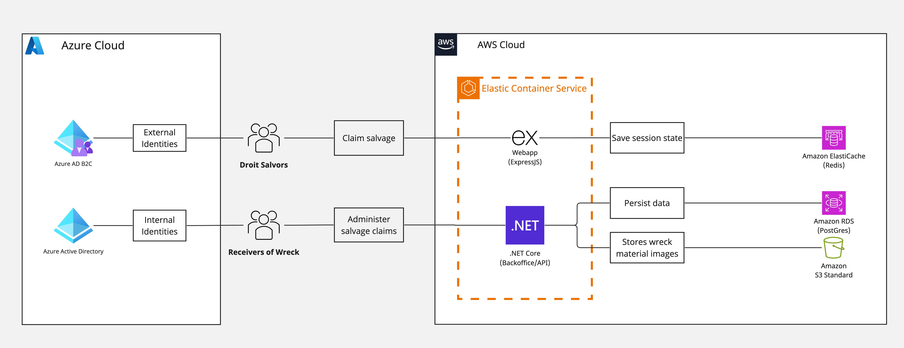

[](https://github.com/mcagov/droits/actions/workflows/pipeline-staging.yml)
[](https://github.com/mcagov/droits/actions/workflows/pipeline-prod.yml)

# Droits reporting service

The Droits reporting service enables:

- Salvage owners to report their findings with the Maritime & CoastGuard Agency
- Receivers of Wreck to manage these reports

It comprises two applications:

1. A public facing frontend.
   - Source code is in the `webapp/` directory.
   - Application specific documentation is in the [README](./webapp/README.md).
2. The backoffice API which handles the incoming registrations and is an admin application to handle the reports
   - Source code is in the `backoffice/` directory.
   - Application specific documentation is in the [README](./backoffice/README.md).

## Architecture



Infrastructure-as-code remains the single source-of-truth for Droits infrastructure! Always check `terraform/` if
unsure.

## Local development

- Make sure you have the required versions of things installed.
   - Install [asdf](asdf-vm.com), or 'brew install asdf' which will automatically manage this.
   - See the `.tool-versions` if you want to manage them some other way.
- Add your local config files:
  - `webapp/.env.json` (get the content s from the "Droits Local - webapp/.env.json" secret in 1Password)
  - `backoffice/src/appsettings.json` (get the content s from the "Droits Local - backoffice/src/appsettings.json" secret in 1Password)
- Install all the things, setup commit hooks etc.
   - ```bash
    # From the root of this repository
    make setup
    ```
- Ensure you have created the development certificate:
  - ```bash
    dotnet dev-certs https -ep ${HOME}/.aspnet/https/aspnetapp.pfx -p password
    ```
  - You will need to unlock your keyvault with your MacBook password
- Start up the applications in development mode, with backing services
   - ```bash
    # From the root of this repository
    make serve
    ```
  
At the time of writing, this will fire up the service using Docker Compose.

It would be nice to have Makefile commands to fire up the two applications outside of Docker for easier development work. For now though, look at [webapp README](./webapp/README.md) and [backoffice README](./backoffice/README.md).

### Troubleshooting

- Instance fails to start: If you ran `docker compose up` before creating and populating the `.env.json` and `appsettings.json` files, this will cause the instance to fail. To resolve this, clean up the environment and run the command again.

- Port 5005 is unavailable: If you encounter a port binding error, port `5005` is already in use. To solve this, run `HOST_PORT=5002 docker compose up` (or alternative port number)

## Infrastructure-as-code

The [Terraform](./terraform) directory contains the Terraform code for managing the infrastructure for the Droits
reporting service.

## Deployment

Automated testing, building and deployment is performed using GitHub Actions with configuration held in
`.github/workflows`.

### Development environment

A build and deployment to the development environment is triggered on each push to `main`. Docker images are tagged
with the hash of the triggering commit and published to AWS Elastic Container Registry. Images built and deployed to
for the development environment are ephemeral and not used anywhere else.

### Staging environment

A build and deployment to the staging environment is triggered on a manual release set to "pre-release". Docker images are tagged
with the hash of the triggering commit and published to AWS Elastic Container Registry. Images built and deployed to
for the staging environment are ephemeral and not used anywhere else.

### Production environment

A build and deployment to the production environment is triggered on a manual release set to "release". Docker images are tagged
with the hash of the triggering commit and published to AWS Elastic Container Registry. Images built and deployed to
for the production environment are ephemeral and not used anywhere else.

## Secrets

Secrets are set in the Repository and injected during deployment.

## License

Unless stated otherwise, the codebase is released under [the MIT License][mit]. This covers both the codebase and any
sample code in the documentation.

The documentation is [&copy; Crown copyright][copyright] and available under the terms of the [Open Government 3.0][ogl]
licence.

[mit]: LICENCE
[copyright]: http://www.nationalarchives.gov.uk/information-management/re-using-public-sector-information/uk-government-licensing-framework/crown-copyright/
[ogl]: http://www.nationalarchives.gov.uk/doc/open-government-licence/version/3/
