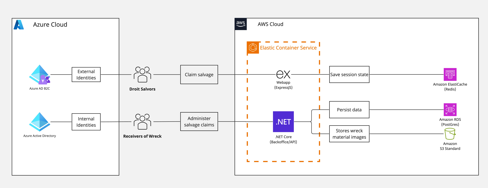

[](https://github.com/mcagov/droits/actions/workflows/pipeline-staging.yml)
[](https://github.com/mcagov/droits/actions/workflows/pipeline-prod.yml)

# Droits reporting service

The Droits reporting service enables:

- Salvage owners to report their findings with the Maritime & CoastGuard Agency
- Receivers of Wreck to manage these reports

It comprises two applications

1. A public facing frontend etc. in the `webapp/` directory
2. The backoffice API which handles the incoming registrations and is an admin application to handle the reports

## Architecture



Infrastructure-as-code remains the single source-of-truth for Droits infrastructure! Always check `terraform/` if
unsure.

## Local development

| **dependency**                                                    | **version** |
|-------------------------------------------------------------------|-------------|
| [dotnet](https://learn.microsoft.com/en-us/dotnet/)               | 8.x         |
| [nvm](https://github.com/nvm-sh/nvm)                              | 0.39.5      |
| [node](https://github.com/nvm-sh/nvm)                             | 14.19.2     |
| [terraform](https://www.terraform.io/)                            | 1.4.6       |
| [Docker desktop](https://www.docker.com/products/docker-desktop/) | Latest      |

# How to run the app 🚀

## Install prerequisites

We recommend using [mise-en-place](https://mise.jdx.dev/) to install the required tools specified in [.tool-versions](../.tool-versions).

## Install dependencies

```shell
# From the webapp directory...

 npm install
```

## Create a `.env.json` file

Populate it with the contents of the "Webapp .env.dev.json" in 1Password.

## Run the app

### Start the Express server

```shell
# From the webapp directory...

 npm run start
```

### Start both the Express server and frontend

```shell
# From the webapp directory...

 npm run dev
```

## Testing

### Run the unit tests

```shell
# From the webapp directory...

npm run test
```

### Mutation testing

We use [Stryker Mutator](https://stryker-mutator.io/docs/stryker-js/introduction/) as a tool to help us understand how much we can trust our unit tests.

Every mutation that survives is a line of code that we can change without it being picked up by our unit tests.

To run the mutation tests:

```shell
# From the webapp directory...

stryker run
```

This will take a while, so you are not going to be running it after every commit.

Once it completes, there should be an HTML report in `reports/mutation/mutation.html`.

## Access the back office component

- [Log in to Microsoft Power Automate Flow](https://unitedkingdom.flow.microsoft.com/manage/environments/93b4f1ed-cbc0-4b5a-b71c-8465c4d011b7/flows/shared)
## Infrastructure-as-code

The [Terraform](./terraform) directory contains the Terraform code for managing the infrastructure for the Droits
reporting service.

## Deployment

Automated testing, building and deployment is performed using GitHub Actions with configuration held in
`.github/workflows`.

### Development environment

A build and deployment to the development environment is triggered on each push to `main`. Docker images are tagged
with the hash of the triggering commit and published to AWS Elastic Container Registry. Images built and deployed to
for the development environment are ephemeral and not used anywhere else.

### Staging environment

A build and deployment to the staging environment is triggered on a manual release set to "pre-release". Docker images are tagged
with the hash of the triggering commit and published to AWS Elastic Container Registry. Images built and deployed to
for the staging environment are ephemeral and not used anywhere else.

### Production environment

A build and deployment to the production environment is triggered on a manual release set to "release". Docker images are tagged
with the hash of the triggering commit and published to AWS Elastic Container Registry. Images built and deployed to
for the production environment are ephemeral and not used anywhere else.

## Secrets

Secrets are set in the Repository and injected during deployment.

## License

Unless stated otherwise, the codebase is released under [the MIT License][mit]. This covers both the codebase and any
sample code in the documentation.

The documentation is [&copy; Crown copyright][copyright] and available under the terms of the [Open Government 3.0][ogl]
licence.

[mit]: LICENCE
[copyright]: http://www.nationalarchives.gov.uk/information-management/re-using-public-sector-information/uk-government-licensing-framework/crown-copyright/
[ogl]: http://www.nationalarchives.gov.uk/doc/open-government-licence/version/3/
